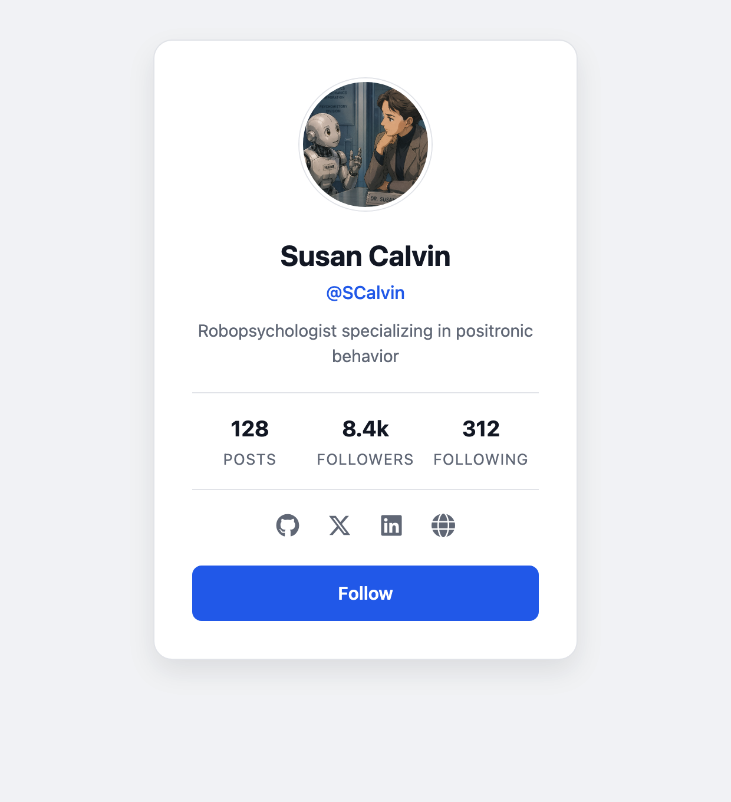

# Susan Calvin Profile Page

A small static profile-card built with React + Vite — featuring Dr. Susan Calvin,
robopsychologist from Isaac Asimov's *I, Robot*.

## Preview



## Tech

- [React](https://react.dev/)
- [Vite](https://vite.dev/)
- [react-icons](https://react-icons.github.io/react-icons/) for the social icons

## Getting started

```bash
npm install
npm run dev
```

Then open the local URL Vite prints (e.g. http://localhost:5173/).

## Structure

The card is composed of small, focused components in `src/components/`:

| Component | Responsibility |
| --- | --- |
| `Avatar` | Circular profile image |
| `ProfileInfo` | Name, handle, and bio |
| `StatsRow` | Posts / Followers / Following counts |
| `SocialLinks` | Social media icon links |
| `FollowButton` | Call-to-action button |

Global page styles live in `src/index.css`; the card styling lives in `src/App.css`.
